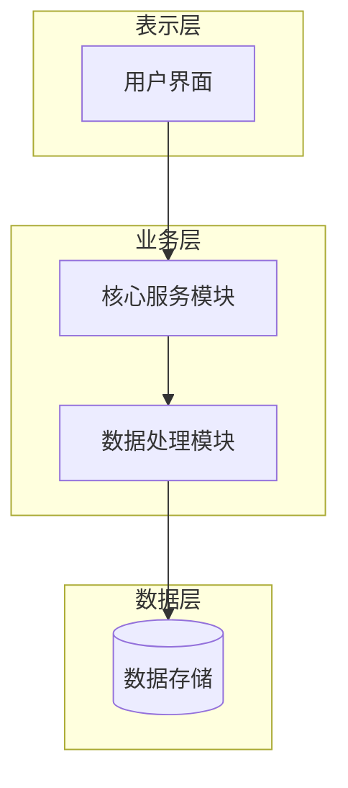

# 工程手册 Agent 系统优化建议文档

> **文档目的**：基于测试结果分析，提出 Prompt 和节点架构的改进方案
> **分析基础**：`test.md` 输出结果 + `handbook_agent.py` 代码
> **编写日期**：2026年1月21日

---

## 一、当前问题诊断

### 1.1 内容空泛/虚构（最严重）

**现象**：
- 输出中出现大量虚构的具体细节，如"张明、李华、王哲"等假名字
- 虚构了代码仓库链接 `https://github.com/OpenAssistTech/BlindVision-Qwen`
- 虚构了详细的测试数据（"准确率93.7%"、"延迟1.2秒"等）
- 编造了用户反馈（"王先生（全盲，58岁）"）
- 如果有编造情况，要（）提醒用户填入信息，而不能直接使用编造内容

**根因分析**：
1. 用户只提供了简略的项目说明，没有源代码和过程材料
2. `_analyze_materials` 节点只提取抽象信息，没有约束"不要虚构"
3. 各章节 Prompt 没有明确要求"基于提供的材料，不要编造"
4. 缺少"素材不足时的占位符机制"

### 1.2 结构格式不规范

**现象**：
- 缺少 Mermaid 架构图和数据流图
- 术语表、修订历史没有使用标准表格格式
- 技术选型缺少对比分析表格
- 缺少需求文档中提到的"文档编号系统"

**根因分析**：
1. Prompt 没有明确要求输出特定格式
2. 没有提供 Mermaid 图和表格的格式模板

### 1.3 深度/专业度不足

**现象**：
- 技术选型只说"选择了Qwen因为它好"，缺乏对比分析
- 缺乏"考虑过哪些替代方案"、"做了什么权衡取舍"
- 实现部分的 CAIR 结构不够具体

**根因分析**：
1. Prompt 太笼统，没有引导模型深入展开
2. 缺乏"追问式"引导词

### 1.4 体系差异化不明显

**现象**：
- US/UK/HK-SG 三个版本的核心内容几乎相同
- US 版本虽有第一人称，但深度反思不够
- UK 版本缺少学术引用
- HK-SG 版本缺少详细架构图和量化数据

**根因分析**：
1. `SYSTEM_STYLES` 只是一句话的风格描述，约束力太弱
2. 没有针对不同体系调整章节权重和详细程度

### 1.5 缺少 Word/PDF 导出

**现象**：用户期望多格式输出，当前只支持 Markdown

---

## 二、Prompt 优化方案

### 2.1 材料分析节点（`_analyze_materials`）优化

**当前 Prompt**：
```
你是工程文档分析师。根据输入材料提取关键信息，输出JSON，字段包括：
problem_statement, target_users, solution_summary, tech_stack, metrics, challenges, achievements, keywords。
要求中文输出，JSON必须可解析。
```

**优化后 Prompt**：
```
你是工程文档分析专家。请严格基于用户提供的材料进行分析，遵循以下原则：

【信息提取原则】
1. 只提取材料中明确提及的信息，绝对不要推测或虚构具体细节
2. 对于每个字段，如果材料中没有明确提及，填写"未提供"而不是编造
3. 识别并列出材料中缺少的关键信息

【输出 JSON 格式】
{
  "problem_statement": "问题陈述（材料未提及则填'未提供'）",
  "target_users": "目标用户群体",
  "solution_summary": "解决方案概述",
  "tech_stack": ["技术1", "技术2"],  // 数组格式
  "provided_metrics": ["材料中明确提供的量化指标"],  // 若无则空数组
  "challenges_mentioned": ["材料中明确提到的挑战"],  // 若无则空数组
  "code_highlights": ["从代码中提取的关键实现点"],  // 若无代码则空数组
  "missing_info": ["缺少具体测试数据", "缺少技术对比分析", ...],  // 缺失信息列表
  "evidence_level": "high/medium/low",  // 材料充分度评估
  "raw_keywords": ["关键词1", "关键词2"]
}

【重要】evidence_level 判断标准：
- high: 有详细项目说明 + 源代码 + 过程材料
- medium: 有项目说明但缺少代码或细节
- low: 只有简单描述或关键词
```

### 2.2 通用 Prompt 约束（加入每个章节）

```
【关键约束 - 必须遵守】
1. 只使用分析信息中明确提供的数据，禁止虚构任何具体的：
   - 人名、团队成员名字
   - 代码仓库链接、URL
   - 具体数字（准确率、延迟、百分比等）
   - 用户反馈、测试案例
2. 当信息不足时，使用占位符明确标注，格式为：[待补充：xxx]
   例如：[待补充：具体测试数据]、[待补充：代码仓库链接]
3. 避免使用"例如"、"如"、"比如"来引入编造的例子
4. 可以基于技术栈进行合理的技术原理解释，但不能编造项目特定的实现细节
```

### 2.3 各章节 Prompt 优化

#### 元数据章节

**优化后**：
```
生成文档元数据内容，严格要求：

1. **项目名称**
   - 中文：使用用户提供的项目中文名
   - 英文：使用用户提供的英文名，若未提供则合理翻译，并标注[自动翻译]

2. **作者信息**
   - 使用用户提供的作者名
   - 若未提供，写：作者：[待补充]

3. **版本号**：v1.0.0

4. **完成日期**
   - 使用用户提供的日期
   - 若未提供，写：[待补充完成日期]

5. **修订历史**（使用Markdown表格）
| 版本号 | 修订日期 | 修订人 | 修订说明 |
|--------|----------|--------|----------|
| v1.0.0 | [日期] | [作者] | 初版文档建立 |

6. **术语表**（使用Markdown表格，3-6个关键术语）
| 术语 | 定义 | 项目应用 |
|------|------|----------|
| [术语1] | 通用定义 | 在本项目中的具体应用说明 |

【注意】术语表基于 tech_stack 中的技术生成，定义可以使用通用技术知识，但"项目应用"列若材料未提供则写[待补充具体应用场景]
```

#### 执行摘要章节

**优化后**：
```
生成执行摘要，控制在1页以内，包含以下四个部分：

1. **问题陈述**
   - 用1-2句话说明要解决什么问题
   - 基于 problem_statement 字段
   - 若为"未提供"，写：本项目旨在[待补充：具体问题描述]

2. **解决方案概述**
   - 用1-2句话概述技术方案
   - 基于 solution_summary 和 tech_stack
   - 说明核心技术选择

3. **关键技术指标**
   - 列出 3-5 个量化结果
   - 仅使用 provided_metrics 中的数据
   - 若 provided_metrics 为空，写：
     - [待补充：核心功能完成度指标]
     - [待补充：性能指标（如响应时间）]
     - [待补充：用户满意度指标]

4. **个人贡献声明**
   - 若有 author_name，以第一人称描述贡献
   - 若未提供，写：本人在项目中负责[待补充：具体贡献内容]
```

#### 问题定义与需求分析章节

**优化后**：
```
生成问题定义与需求分析章节，包含以下部分：

1. **背景调研**
   - 问题为什么重要？（可基于问题陈述合理展开）
   - 现有解决方案有什么不足？（若材料未提及，标注[待补充：竞品/现有方案分析]）
   - 相关技术发展现状（可使用通用技术知识）

2. **利益相关者分析**
   - 基于 target_users 展开
   - 格式：
     - 主要用户群体：xxx
     - 核心诉求：[根据问题陈述推断]
     - 约束条件：[待补充：如时间、成本、技术限制]

3. **需求规格说明**（使用表格格式）

| 需求类型 | 需求描述 | 优先级 |
|----------|----------|--------|
| 功能性需求 | [基于solution_summary推断] | 高 |
| 非功能性需求 | [如性能、安全、可用性] | 中 |

4. **成功标准定义**
   - 若有 provided_metrics，基于此定义成功标准
   - 若无，写：成功标准定义需基于以下待确认指标：
     - [待补充：功能完成度标准]
     - [待补充：性能基准标准]
```

#### 系统设计章节

**优化后**：
```
生成系统设计章节，要求：

1. **技术选型与理由**
   - 列出 tech_stack 中的主要技术
   - 必须使用对比分析表格：

| 技术方案 | 优点 | 缺点 | 选择理由 |
|----------|------|------|----------|
| [选用的技术] | ... | ... | ✓ 选择，因为... |
| [备选方案1] | ... | ... | ✗ 未选择，因为... |
| [备选方案2] | ... | ... | ✗ 未选择，因为... |

   【注意】若材料未提供对比分析，备选方案可基于技术知识合理补充，但标注[基于技术调研推断]

2. **系统架构设计**
   - 必须使用 Mermaid 语法绘制架构图：



   - 若材料未提供架构细节，基于 tech_stack 设计通用架构，标注[基于技术栈推断的架构设计]

3. **数据流与交互逻辑**
   - 使用 Mermaid 时序图或流程图
   - 描述主要数据流动路径

4. **接口规范**（如适用）
   - 若有代码片段，从中提取接口信息
   - 若无，写：接口规范[待补充：详细API定义]
```

#### 实现与迭代章节

**优化后**：
```
生成实现与迭代章节，使用 CAIR 结构（Challenge/Approach/Implementation/Result）：

1. **开发环境与工具链**
   - 基于 tech_stack 列出编程语言、框架、工具
   - 若材料提供了代码，从代码注释/import语句中提取信息

2. **核心模块实现**
   为每个主要功能模块使用统一结构：

   **模块：[模块名称]**

   | 维度 | 描述 |
   |------|------|
   | 挑战(Challenge) | 遇到什么问题？[若材料未提及，写"待补充"] |
   | 思路(Approach) | 设计什么方案？ |
   | 实现(Implementation) | 如何实现？[若有代码则引用] |
   | 结果(Result) | 效果如何？[使用provided_metrics，若无则写"待补充量化结果"] |

3. **关键技术挑战与解决方案**
   - 基于 challenges_mentioned 展开
   - 若为空，写：关键技术挑战[待补充：项目中遇到的主要困难及解决方案]

4. **版本迭代记录**（使用表格）

| 版本 | 主要变更 | 变更原因 |
|------|----------|----------|
| v0.1 | 初始原型 | 验证核心功能可行性 |
| v1.0 | [待补充] | [待补充] |
```

#### 测试与验证章节

**优化后**：
```
生成测试与验证章节：

1. **测试策略说明**
   - 采用什么测试方法？（可基于项目类型合理推断）
   - 为什么选择这种方法？

2. **测试用例与执行结果**（使用表格）

| 测试类别 | 测试用例 | 预期结果 | 实际结果 |
|----------|----------|----------|----------|
| 功能测试 | [基于功能需求] | [预期行为] | [待补充] |
| 性能测试 | [基于性能需求] | [性能指标] | [待补充] |

【重要】"实际结果"列若材料未提供具体数据，必须写[待补充]

3. **性能基准测试**
   - 若 provided_metrics 有数据，使用这些数据
   - 若无，写：
     - 测试环境：[待补充]
     - 性能基准：[待补充具体测试数据]

4. **用户测试反馈**
   - 若材料提供了用户反馈，使用实际内容
   - 若无，写：用户测试反馈[待补充：实际用户使用体验和建议]
   - 禁止编造假用户和假反馈
```

#### 反思与展望章节

**优化后**：
```
生成反思与展望章节：

1. **工程经验总结**
   - 通过这个项目学到了什么？
   - 哪些技术决策是正确的？（基于tech_stack分析）
   - 如果重新开始会怎么做？

2. **技术债务与已知限制**
   - 基于 missing_info 和 evidence_level 诚实说明不足
   - 格式：
     - 已知限制 1：[具体限制]
     - 已知限制 2：[具体限制]
   - 若材料未提及限制，写：
     - [待补充：项目当前存在的技术限制]
     - [待补充：因时间/资源限制未完成的功能]

3. **未来改进方向**
   - 如果有更多时间和资源，会如何优化？
   - 可以基于技术栈提出合理的改进建议
```

#### 附录章节

**优化后**：
```
生成附录章节：

1. **附录A：代码仓库链接**
   - 若提供了 source_code_url，使用实际链接
   - 若未提供，写：代码仓库：[待补充：GitHub/GitLab链接]
   - 禁止编造假链接

2. **附录B：关键代码片段**
   - 若提供了源代码，从中选取 2-3 个关键片段并添加注释说明
   - 若未提供代码，写：
     ```
     // 关键代码片段[待补充]
     // 建议补充：核心算法实现、主要功能模块代码
     ```

3. **附录C：原始数据样本**
   - 若材料提供了数据，整理展示
   - 若无，写：原始数据样本[待补充：测试数据、训练数据等]

4. **附录D：参考文献列表**
   - 可基于 tech_stack 列出相关技术的官方文档链接
   - 格式示例：
     - [1] [技术名] 官方文档. https://[真实官方链接]
   - 若需要学术引用但材料未提供，写：[待补充：相关学术论文引用]
```

---

## 三、体系差异化强化方案

### 3.1 US 体系（美国本科申请）

**完整 Prompt 前缀**：
```
【申请体系】美国本科（Common App / Coalition App）

【核心目标】展示申请者作为一个人的特质、动机和成长历程

【写作风格要求】
1. 使用第一人称叙事，建立情感连接
2. 每个技术决策都要说明"我为什么这样选择"
3. 适度加入困难时刻的心理描写和克服过程
4. 强调项目对自己的影响和个人成长

【章节侧重】
- 执行摘要：强调个人动机（为什么我对这个问题感兴趣）
- 问题定义：加入对社区/用户的实际影响
- 实现与迭代：描述遇到困难时的心理状态和坚持
- 反思与展望：详细展开，这是核心章节，需占较大篇幅

【篇幅建议】15-20页，可视化内容比例较高

【语言示例】
✓ "当我第一次接触到这个问题时，我被深深触动了..."
✓ "那个调试到凌晨三点的夜晚，我几乎要放弃，但..."
✗ "系统采用了xxx架构"（太客观，缺乏个人色彩）
```

### 3.2 UK 体系（英国 UCAS 申请）

**完整 Prompt 前缀**：
```
【申请体系】英国 UCAS Personal Statement 配套材料

【核心目标】展示对所申请学科的学术热情和知识深度

【写作风格要求】
1. 学术化、客观严谨，避免过多个人情感表达
2. 强调对技术原理和学术背景的理解
3. 技术选型需体现学术思考
4. 参考文献必须规范

【章节侧重】
- 问题定义：必须详实，展示对领域现状的深入了解
- 系统设计：技术选型部分需引用相关技术论文或权威资料
- 附录：参考文献必须规范完整，使用APA或IEEE格式

【参考文献格式】
- 使用方括号标注引用：[1], [2], [3]
- 附录中列出完整引用信息：
  [1] 作者. 论文标题. 期刊/会议, 年份.
  [2] 作者. 书名. 出版社, 年份.

【篇幅建议】10-15页，以文字论述为主

【语言示例】
✓ "根据[1]的研究表明，该技术在xxx领域具有显著优势"
✓ "从学术角度分析，选择此方案是因为..."
✗ "我觉得这个技术很酷"（太口语化）
```

### 3.3 HK-SG 体系（香港/新加坡申请）

**完整 Prompt 前缀**：
```
【申请体系】香港、新加坡院校本科申请

【核心目标】展示技术硬实力和工程规范性

【写作风格要求】
1. 技术化、数据驱动
2. 大量使用图表、代码和量化数据
3. 强调工程规范和最佳实践
4. 详细的技术细节展示

【章节侧重】
- 系统设计：必须非常详细，包含完整的 Mermaid 架构图、数据流图、类图
- 实现与迭代：多展示代码片段，体现编程规范
- 测试与验证：必须有充分的量化数据，包含性能对比表格

【必须包含的图表】
1. 系统架构图（Mermaid graph TD）
2. 数据流图（Mermaid flowchart 或 sequenceDiagram）
3. 技术选型对比表
4. 性能测试结果表
5. 至少3个代码片段（带详细注释）

【篇幅建议】20-30页，技术细节完整呈现

【代码展示要求】
```python
# 示例：要求注释说明每个关键步骤
def process_data(input_data):
    """
    数据处理核心函数

    Args:
        input_data: 原始输入数据

    Returns:
        处理后的结果
    """
    # Step 1: 数据预处理
    cleaned = preprocess(input_data)

    # Step 2: 核心算法处理
    result = core_algorithm(cleaned)

    return result
```

【语言示例】
✓ "系统在1000次测试中达到了95.3%的准确率，响应延迟p99为127ms"
✓ "如架构图所示，系统采用三层结构..."
✗ "系统表现很好"（缺乏具体数据）
```

### 3.4 章节权重配置

```python
SYSTEM_SECTION_WEIGHTS = {
    "US": {
        "metadata": "标准",
        "executive_summary": "详细（强调个人动机，约1.5页）",
        "problem_definition": "中等（强调社会影响）",
        "system_design": "中等",
        "implementation": "中等（强调克服困难的过程）",
        "testing": "简要",
        "reflection": "非常详细（核心章节，约3-4页）",
        "appendix": "简要"
    },
    "UK": {
        "metadata": "标准",
        "executive_summary": "简要客观",
        "problem_definition": "非常详细（核心章节，强调学术调研，约3-4页）",
        "system_design": "详细（强调技术论证和引用）",
        "implementation": "中等",
        "testing": "中等",
        "reflection": "中等（学术反思风格）",
        "appendix": "详细（必须有规范的参考文献列表）"
    },
    "HK-SG": {
        "metadata": "标准",
        "executive_summary": "简要（数据驱动）",
        "problem_definition": "中等",
        "system_design": "非常详细（核心章节，必须有多个Mermaid图，约4-5页）",
        "implementation": "详细（多代码片段，约4-5页）",
        "testing": "非常详细（核心章节，大量表格和数据，约3-4页）",
        "reflection": "简要",
        "appendix": "详细（完整代码和数据样本）"
    }
}
```

---

## 四、节点架构优化

### 4.1 增加素材充分度检测

在生成开始前，检测输入材料是否充分，并给用户反馈：

```python
def _check_material_sufficiency(self, analysis):
    """检查素材充分度，返回缺失项和建议"""

    evidence_level = analysis.get('evidence_level', 'low')
    missing_info = analysis.get('missing_info', [])

    feedback = {
        'level': evidence_level,
        'can_proceed': True,
        'warnings': [],
        'suggestions': []
    }

    if evidence_level == 'low':
        feedback['warnings'].append(
            "⚠️ 输入材料较为简略，生成的文档将包含较多[待补充]占位符"
        )
        feedback['suggestions'] = [
            "建议补充：详细的项目说明文档",
            "建议补充：关键代码片段",
            "建议补充：测试数据和结果",
            "建议补充：项目过程中遇到的挑战和解决方案"
        ]
    elif evidence_level == 'medium':
        feedback['warnings'].append(
            "ℹ️ 部分信息缺失，相关章节将使用占位符"
        )
        feedback['suggestions'] = [
            f"建议补充：{item}" for item in missing_info[:3]
        ]

    return feedback
```

### 4.2 生成后质量检查

生成完成后，检查输出质量：

```python
def _post_generation_check(self, content):
    """生成后质量检查"""

    issues = []

    # 检查是否有过多占位符
    placeholder_count = content.count('[待补充')
    if placeholder_count > 20:
        issues.append(f"文档中有{placeholder_count}处待补充内容，建议补充更多素材后重新生成")

    # 检查是否缺少图表（针对HK-SG）
    if 'mermaid' not in content.lower() and self.system_type == 'HK-SG':
        issues.append("HK-SG版本建议包含Mermaid架构图")

    # 检查是否有可疑的虚构内容（检测常见假链接模式）
    suspicious_patterns = [
        r'github\.com/[A-Z][a-z]+[A-Z][a-z]+/',  # 驼峰式假仓库名
        r'\d{2}\.\d%',  # 过于精确的百分比
    ]
    # ...

    return issues
```

---

## 五、Word/PDF 导出功能

### 5.1 依赖安装

```bash
pip install python-docx markdown weasyprint
# 或使用 pdfkit（需要安装 wkhtmltopdf）
pip install pdfkit
```

### 5.2 导出工具类

新建 `utils/export_helper.py`：

```python
import markdown
from docx import Document
from docx.shared import Pt, Inches
from docx.enum.text import WD_ALIGN_PARAGRAPH
import re

class HandbookExporter:
    """工程手册导出工具"""

    def to_word(self, md_content, output_path, title="工程手册"):
        """Markdown 转 Word"""
        doc = Document()

        # 设置标题
        doc.add_heading(title, 0)

        # 解析 Markdown 并转换
        lines = md_content.split('\n')
        for line in lines:
            if line.startswith('## '):
                doc.add_heading(line[3:], level=1)
            elif line.startswith('### '):
                doc.add_heading(line[4:], level=2)
            elif line.startswith('- '):
                doc.add_paragraph(line[2:], style='List Bullet')
            elif line.startswith('|'):
                # 表格处理（简化版）
                self._add_table_row(doc, line)
            elif line.strip():
                doc.add_paragraph(line)

        doc.save(output_path)
        return output_path

    def to_pdf(self, md_content, output_path):
        """Markdown 转 PDF"""
        # 使用 markdown 库转换为 HTML
        html = markdown.markdown(
            md_content,
            extensions=['tables', 'fenced_code', 'codehilite']
        )

        # 添加样式
        styled_html = f"""
        <!DOCTYPE html>
        <html>
        <head>
            <meta charset="utf-8">
            <style>
                body {{ font-family: 'SimSun', serif; line-height: 1.6; padding: 40px; }}
                h1 {{ color: #333; border-bottom: 2px solid #0ea5e9; }}
                h2 {{ color: #0ea5e9; }}
                table {{ border-collapse: collapse; width: 100%; margin: 20px 0; }}
                th, td {{ border: 1px solid #ddd; padding: 8px; text-align: left; }}
                th {{ background-color: #0ea5e9; color: white; }}
                code {{ background-color: #f4f4f4; padding: 2px 6px; }}
                pre {{ background-color: #f4f4f4; padding: 15px; overflow-x: auto; }}
            </style>
        </head>
        <body>{html}</body>
        </html>
        """

        # 使用 weasyprint 或 pdfkit 生成 PDF
        # weasyprint.HTML(string=styled_html).write_pdf(output_path)
        # 或
        # pdfkit.from_string(styled_html, output_path)

        return output_path
```

### 5.3 路由扩展

在 `handbook_routes.py` 中添加：

```python
@handbook_bp.route("/api/handbooks/<int:handbook_id>/download/<system_type>/<format>")
def api_download_handbook_format(handbook_id, system_type, format):
    """支持多格式下载：md / docx / pdf"""
    handbook = EngineeringHandbook.query.get_or_404(handbook_id)

    # 获取 Markdown 内容
    content = get_content_for_system(handbook, system_type)
    if not content:
        return jsonify({"error": "该版本尚未生成"}), 400

    exporter = HandbookExporter()

    if format == 'md':
        # 现有逻辑
        ...
    elif format == 'docx':
        output_path = f"/tmp/{handbook_id}_{system_type}.docx"
        exporter.to_word(content, output_path, title=handbook.project_name_cn)
        return send_file(output_path, as_attachment=True)
    elif format == 'pdf':
        output_path = f"/tmp/{handbook_id}_{system_type}.pdf"
        exporter.to_pdf(content, output_path)
        return send_file(output_path, as_attachment=True)
    else:
        return jsonify({"error": "不支持的格式"}), 400
```

---

## 六、优先级与实施计划

| 优先级 | 改进项 | 预期效果 | 工作量 |
|--------|--------|----------|--------|
| **P0** | Prompt 防虚构约束 + 占位符机制 | 消除内容虚构问题 | 小 |
| **P0** | 材料分析节点 Prompt 优化 | 更准确识别信息缺口 | 小 |
| **P1** | 体系差异化 Prompt 前缀 | 三版本有明显区分 | 中 |
| **P1** | 格式规范化（表格模板、Mermaid模板） | 文档更专业 | 中 |
| **P2** | 章节权重配置 | 不同体系侧重不同 | 小 |
| **P2** | 素材充分度检测 | 引导用户补充材料 | 中 |
| **P3** | Word 导出 | 满足用户格式需求 | 中 |
| **P3** | PDF 导出 | 满足用户格式需求 | 中 |

---

## 七、修改文件清单

1. **`utils/handbook_agent.py`**
   - 优化 `_analyze_materials` Prompt
   - 优化 `BASE_SECTION_PROMPTS` 各章节 Prompt
   - 增强 `SYSTEM_STYLES` 为完整的体系 Prompt 前缀
   - 新增 `_check_material_sufficiency` 方法
   - 新增章节权重配置

2. **`utils/export_helper.py`**（新建）
   - `HandbookExporter` 类
   - `to_word()` 方法
   - `to_pdf()` 方法

3. **`routes/handbook_routes.py`**
   - 新增多格式下载路由

4. **`requirements.txt`**
   - 添加 `python-docx`
   - 添加 `markdown`
   - 添加 `weasyprint` 或 `pdfkit`

---

## 八、验证方式

1. **防虚构测试**：使用相同的简略输入重新生成，检查是否仍有虚构内容
2. **体系差异测试**：对比 US/UK/HK-SG 三个版本，确认：
   - US 版本有明显的第一人称叙事和个人反思
   - UK 版本有学术引用标注 [1][2]
   - HK-SG 版本有 Mermaid 图和详细技术表格
3. **占位符测试**：检查信息不足时是否正确使用 `[待补充：xxx]` 格式
4. **格式测试**：检查表格、Mermaid 图是否正确渲染
5. **导出测试**：测试 Word 和 PDF 导出功能
